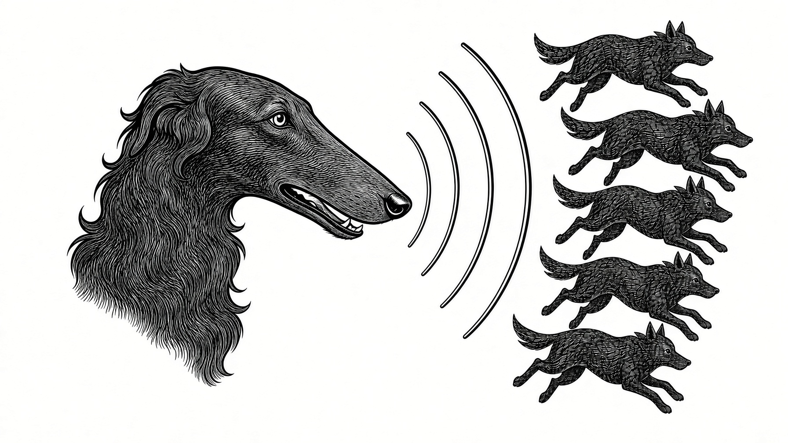

# bellen

Public starter for a **multi-repo** working model: a thin control repo (`*-org`) plus separate product repos. Git is the shared disk.

Use **OWNER/something-org** as the name of each new control repo (example of a real one: `e-St/fspure-org`). This repository is the template and the GitHub Pages form that bootstraps those control repos. It is not a product monorepo.

## 1. What this is

You keep product code in its own repos. You do **not** turn this template, or a control repo copied from it, into an app workspace.

| Piece | Role |
| --- | --- |
| **This repo (`e-St/bellen`)** | Template + Pages initializer (`docs/index.html`) |
| **Control repo `OWNER/something-org`** | Thin GitHub Codespace: OpenHands Agent Canvas + Grok Build |
| **Product repos** | Real apps/libraries. Each has its **own** `.devcontainer` / Codespace |
| **GitHub Actions (`gh-aw`)** | Unattended work when an issue is labeled `agent` |
| **Agent Canvas** | Interactive work in the **control** Codespace when labeled `canvas` |

Interactive sessions use Agent Canvas with ACP command `grok agent stdio`. Humans inspect agent branches in the **product** repo’s editor. Do not prompt in the product editor.

## 2. Architecture

```
                    ┌─────────────────────────────────────┐
  labeled `canvas`  │  Control Codespace                  │
  ─────────────────►│  OWNER/something-org                │
                    │  image: Ubuntu base + GitHub CLI    │
                    │  Node 22 (apt, not a feature)       │
                    │  Grok Build + @openhands/agent-canvas│
                    │  clones product repos →             │
                    │    /workspaces/platform             │
                    │  port 8000 (org) = Agent Canvas     │
                    │  ACP: grok agent stdio              │
                    └─────────────────────────────────────┘
                                      │
                                      │ git push / pull
                                      ▼
                    ┌─────────────────────────────────────┐
                    │  Product repos (separate)           │
                    │  OWNER/something, OWNER/other, …    │
                    │  own .devcontainer / Codespaces     │
                    │  inspect: codespaces.new/…?ref=     │
                    └─────────────────────────────────────┘

  labeled `agent`  ──►  GitHub Actions on the control repo
                        (gh-aw, after a human ran `gh aw compile`)
```

- **Control Codespace** — one thin machine for the agent. Product toolchains do **not** belong here.
- **Product Codespaces** — humans open these to inspect branches. Each product repo keeps its own devcontainer.
- **Actions** — unattended `agent` runs. No Canvas UI.

Never put both `agent` and `canvas` on the same issue.

## 3. One-time (maintainers of bellen)

Do this on **https://github.com/e-St/bellen** (cannot be set from files):

1. **Settings → General → Template repository** — check “Template repository”.
2. **Settings → Pages** — Deploy from branch **main**, folder **/docs**.
3. Confirm **https://e-st.github.io/bellen/** serves `docs/index.html`.

Copies of this template inherit `.github/workflows/after-mastart-pr.yml`. They do not inherit GitHub Pages or the template flag; those stay on bellen.

## 4. Each new project

1. On GitHub: **Use this template** → create **`OWNER/something-org`** (empty README is fine; this template already has files).
2. Open **https://e-st.github.io/bellen/?repo=OWNER/something-org**.
3. Fill **control repo** `OWNER/something-org` (prefilled from the query string) and **product repos** (one `owner/name` per line).
4. Yes, **you** create the PAT on GitHub — bellen cannot mint one. As soon as the product repos parse, the page shows **Create the token on GitHub**. That link opens GitHub’s fine-grained PAT form with **Contents: write**, **Pull requests: write**, resource owner, and a 7-day expiry already filled. On that form, set **Repository access** to **only** `OWNER/something-org`. Generate, copy, paste back into bellen. Open **Why your PAT is safe on this page.** on the form if you want the three-sentence safety note, or to do the same init **without** pasting a token (local `gh` or GitHub’s web editor).
5. Click **Create PR**. The page talks only to `api.github.com`. It opens branch `init/control-canvas` with:
   - `AGENTS.md`
   - `README.md` (short control-repo readme)
   - `.devcontainer/devcontainer.json`
   - `.devcontainer/on-create.sh`
   - `.devcontainer/post-start.sh`
6. Workflow **`after-mastart-pr`** on the new repo amends that PR: it commits a **gh-aw** stub (`.github/workflows/agent.md`) listing the product repos, and posts a checklist comment. A human must still run `gh aw compile`.
7. Human, on **`OWNER/something-org`**:
   - Merge the PR.
   - Add secrets (see [Secrets](#7-secrets)).
   - Install a GitHub App on the **control repo and every product repo** (least privilege).
   - Create labels **`agent`** and **`canvas`**.
   - `gh extension install github/gh-aw` then `gh aw compile`, commit the generated `.lock.yml`.
8. **Code → Create codespace** on the control repo (not on a product repo).
9. After start: **Ports → 8000** (label `agent-canvas`, visibility **org**).
10. In Agent Canvas: enter `LOCAL_BACKEND_API_KEY`, set ACP to **`grok agent stdio`**, workspace **`/workspaces/platform`**.

Revoke the initializer PAT after the PR exists. Codespaces uses your GitHub login to clone product repos you can already access.

## 5. Daily: `canvas` vs `agent`

File issues on the **control** repo. Apply **exactly one** of these labels:

| Label | When | Where it runs |
| --- | --- | --- |
| **`canvas`** | You will sit with the agent | Control Codespace → Canvas on port 8000 → `grok agent stdio` |
| **`agent`** | Unattended | GitHub Actions via gh-aw |

**Never both.** If both are present, stop and remove one.

The agent works in clones under `/workspaces/platform` and **pushes to the product remotes**. Those remotes are the source of truth.

## 6. Inspect

Do not prompt inside a product-repo editor. Open the product’s **own** Codespace (its own `.devcontainer`) on the agent branch:

```
https://codespaces.new/OWNER/PRODUCT?ref=agent/…
```

Example: if the agent pushed `agent/42-fix-login` to `OWNER/something`, inspect at `https://codespaces.new/OWNER/something?ref=agent/42-fix-login`.

VS Code is for reading the diff and running the product toolchain. Conversation stays in Canvas (interactive) or in the Actions log (unattended).

## 7. Secrets

Set these on **`OWNER/something-org`**. Codespace secrets apply to the control Codespace; Actions secrets apply to gh-aw.

| Secret | Where | Purpose |
| --- | --- | --- |
| **`XAI_API_KEY`** | Codespace + Actions | Grok Build / xAI |
| **`LOCAL_BACKEND_API_KEY`** | Codespace | Agent Canvas `--public` (paste it in the Canvas UI) |
| **`APP_ID`** | Actions | GitHub App id |
| **`APP_PRIVATE_KEY`** | Actions | GitHub App private key (`.pem` contents) |

Generate a strong `LOCAL_BACKEND_API_KEY` (for example `openssl rand -base64 32`) and store the same value as the Codespace secret and in your password manager. Anyone with that key and port 8000 can drive the control machine.

The App must be installed on the control repo **and** each product repo so Actions can open PRs where the code lives.

## 8. Security

- **Thin control image** — `mcr.microsoft.com/devcontainers/base:ubuntu` plus the GitHub CLI feature only. No Node devcontainer feature, no product SDKs, no extra npm stack in the image definition. Node 22 is installed in `on-create.sh` solely to run Agent Canvas.
- **Port 8000 visibility `org`** — not public. Still require `LOCAL_BACKEND_API_KEY`.
- **GitHub App least privilege** — only the control repo and its product repos; contents, issues, and pull requests. No org-wide install unless you intend that.
- **Initializer PAT** — fine-grained, one repo, Contents + Pull requests, short-lived. This Pages form never stores it; requests go to `api.github.com` only.
- **Do not commit** `.env` or `*.pem`. See `.gitignore`.

## 9. This repo’s file map

```
bellen/
├── README.md                              ← you are here (template docs)
├── AGENTS.md                              ← bellen is the template/pages repo
├── LICENSE                                ← MIT, Copyright (c) 2025-2026 e-St (same as e-St/fspure)
├── NOTICE                                 ← copyright + MIT pointer
├── .gitignore                             ← .env, *.pem, node_modules
├── docs/
│   ├── logo.jpg                           ← site mark (top of Pages)
│   ├── index.html                         ← GitHub Pages initializer
│   ├── legal.html                         ← license / contact / hosting
│   └── privacy.html                       ← static site + PAT form
└── .github/workflows/
    └── after-mastart-pr.yml               ← amends init/* PRs on copies of this template
```

Files the initializer writes live on **`OWNER/something-org`**, not here:

```
OWNER/something-org/
├── README.md                              ← short control-repo readme
├── AGENTS.md                              ← how to use that control repo
├── .devcontainer/devcontainer.json        ← Ubuntu + github-cli; REPOS; port 8000
├── .devcontainer/on-create.sh             ← Node 22, Grok Build, agent-canvas
├── .devcontainer/post-start.sh            ← clone REPOS, start Canvas
└── .github/workflows/agent.md             ← gh-aw stub (added by after-mastart-pr)
```

## License

MIT License. Copyright (c) 2025-2026 e-St. Same terms as [e-St/fspure](https://github.com/e-St/fspure): see [LICENSE](LICENSE) and [NOTICE](NOTICE).
